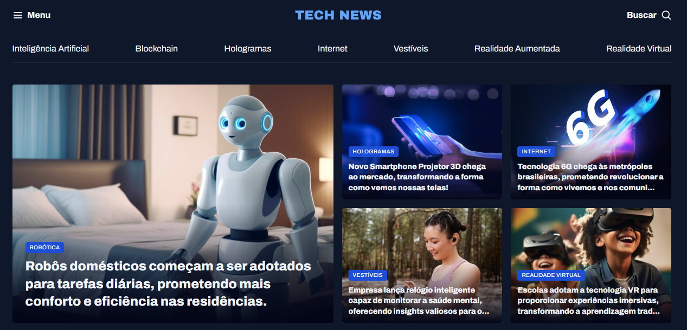

<h1 align="center"> Tech News - Portal de Notícias </h1>

  Um portal de notícias moderno focado em tecnologia, com um layout imersivo em Dark Mode e estrutura robusta de CSS Grid.

  <a href="#-tecnologias">Tecnologias</a>&nbsp;&nbsp;&nbsp;|&nbsp;&nbsp;&nbsp;
  <a href="#-projeto">Projeto</a>&nbsp;&nbsp;&nbsp;|&nbsp;&nbsp;&nbsp;
  <a href="#-layout">Layout</a>&nbsp;&nbsp;&nbsp;|&nbsp;&nbsp;&nbsp;
  <a href="#memo-licença">Licença</a>

  

 

  

## 🚀 Tecnologias

Esse projeto foi desenvolvido com as seguintes tecnologias:

- HTML5
- CSS3 

## 💻 Projeto

O **Tech News** é a interface de um portal de notícias focado no nicho de tecnologia (IA, Realidade Virtual, Blockchain).
O principal desafio deste projeto foi a construção de um layout complexo utilizando **CSS Grid Template Areas**, organizando o conteúdo em seções distintas como:
- **Destaques (Featured):** Notícias principais com imagens de alto impacto.
- **Mais Lidas (Weekly):** Carrossel visual de notícias rápidas.
- **Inteligência Artificial:** Coluna dedicada a artigos verticais.
- **Sidebar:** Área lateral para publicidade e sugestões de leitura.

O projeto segue uma arquitetura CSS modular, separando estilos globais, utilitários e de componentes para facilitar a manutenção.

🔗 [Acesse o projeto online](https://miqueiassantoss.github.io/portal-de-noticias-project/)

## 📝 Licença

Esse projeto está sob a licença MIT.

---

  Feito com 💜 por <a href="https://github.com/miqueiassantoss">Miqueias Santos</a>

